# CITS5503 Lab4
## Wenxiao Zhang 22792191

### [Step 1] Apply policy to restrict permissions on bucket
We use `put_bucket_policy` to set the bucket policy and use `get_bucket_policy` to retrieve the bucket policy. 
The python script and the output are shown below:
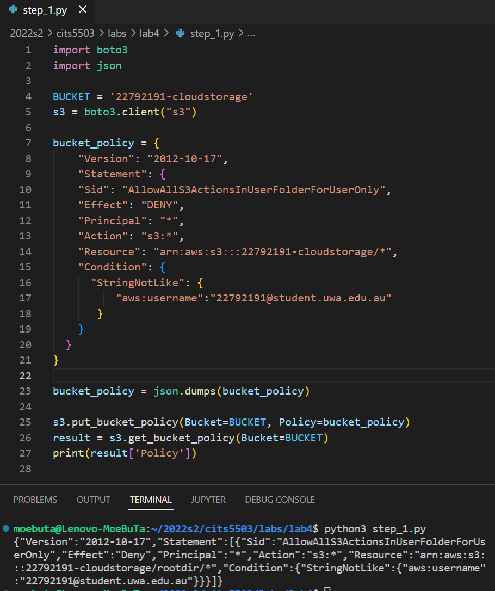

### [Step 2] AES Encryption using KMS

We use `create_key()` and `create_alias()` to create a key and add the alias. The python script and the output are shown below
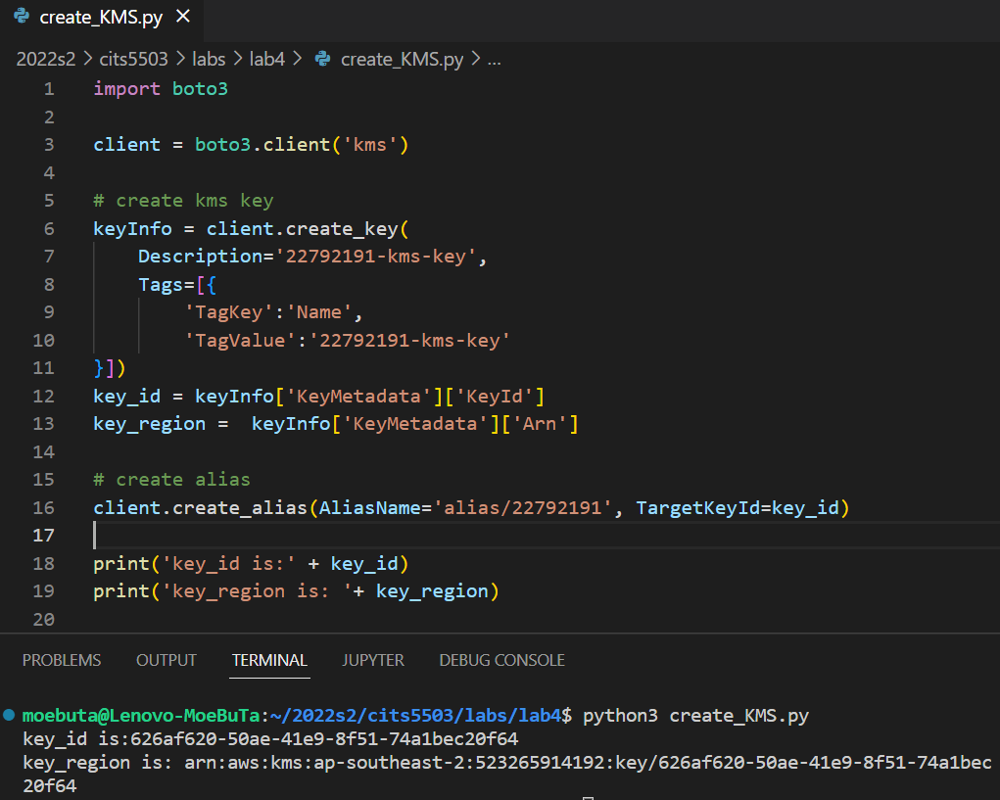

We use `put_key_policy()` set the key policy, and `get_key_policy()` to retrieve it. The python script is shown below:
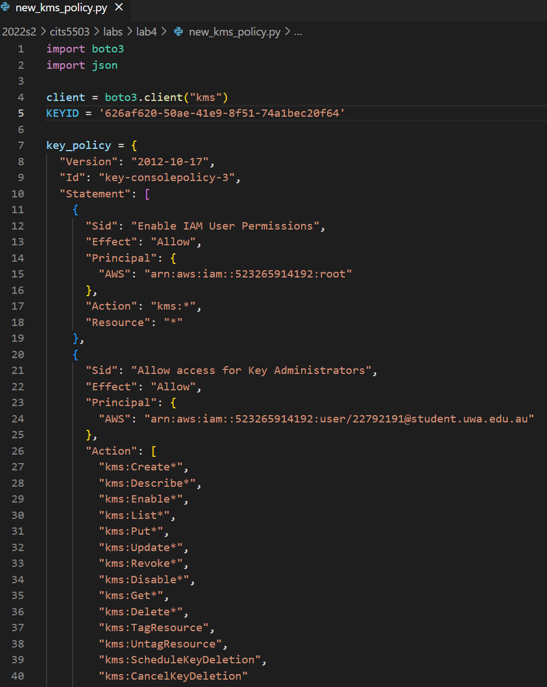

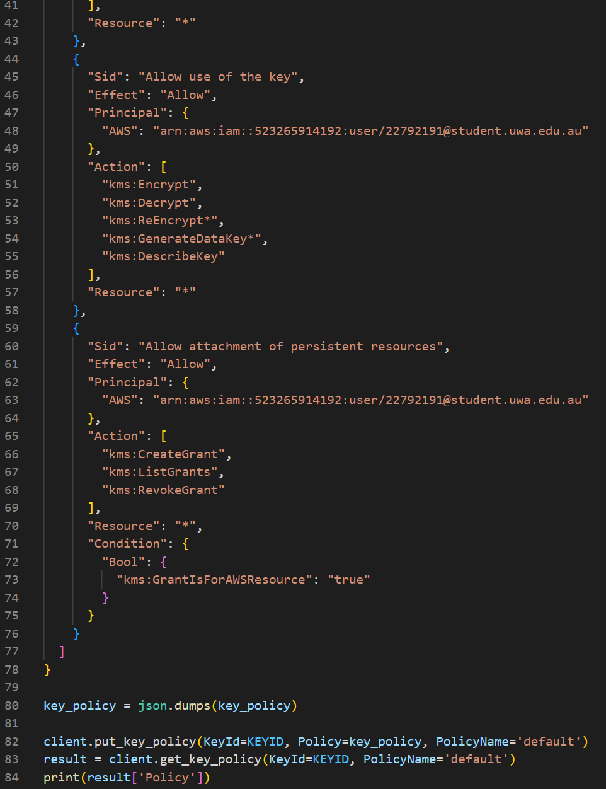

The output is shown below:
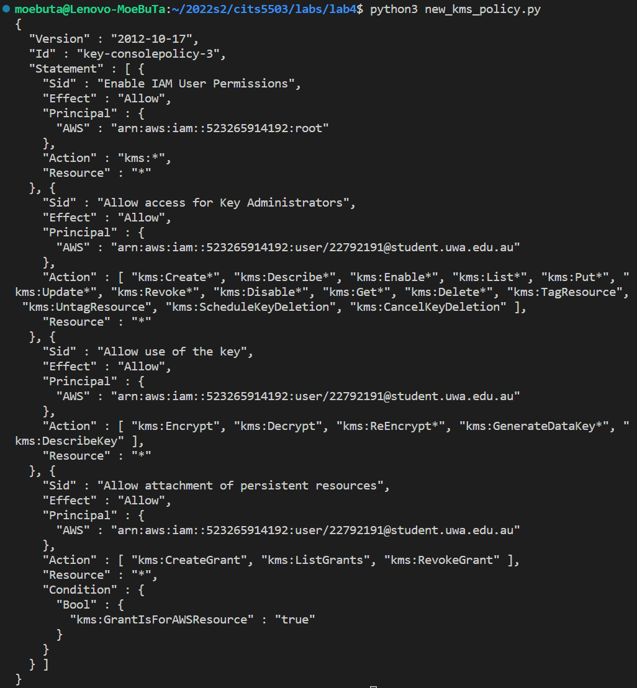

The following works for encryptions and decryptions are written in a python file called `encryptions.py`. 
1. before we executing the script, we create a text file `kms.txt` and write `Hello World!!!` into it.
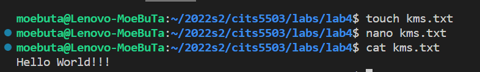

2. import libraries and define necessary variables.
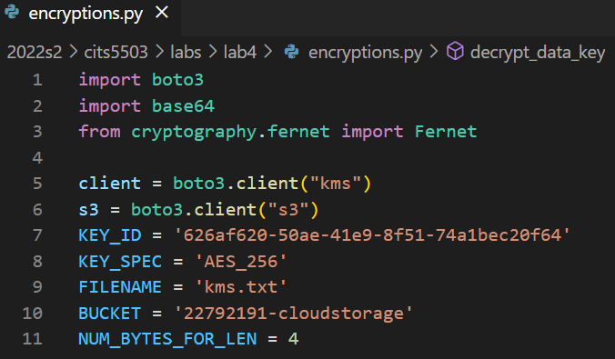

3. `create_data_key()` is for generating the data key from the previous generated kms key. `encrypt_file()` is for encrypting `kms.txt` and uploading it to the bucket. 
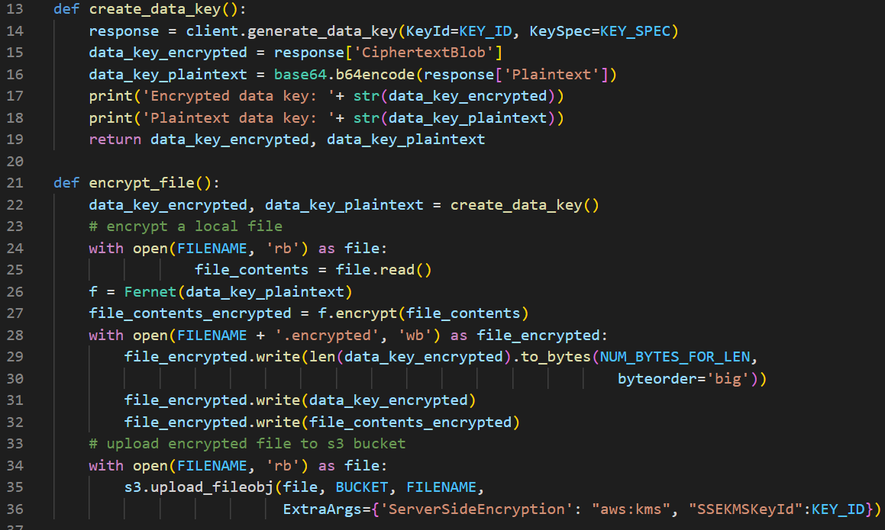

4. `decrypt_data_key()` is for decrypting the data key from the encrypted data key. `decrypt_file()` is for decrypting the file `kms.txt` downloaded from the bucket.
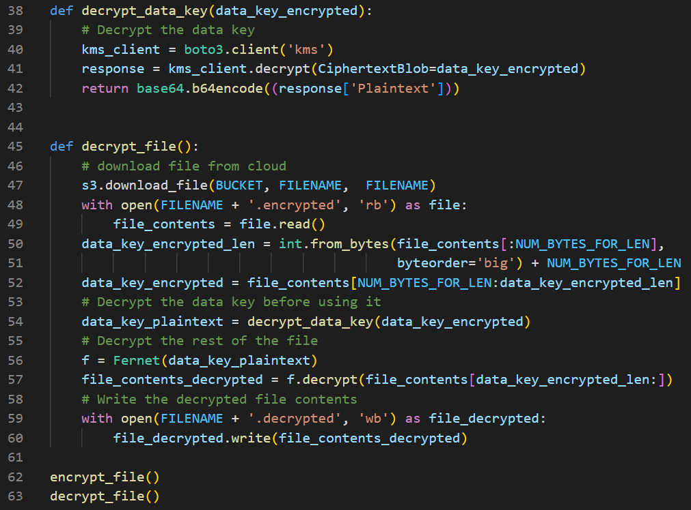

The output for generating data key:
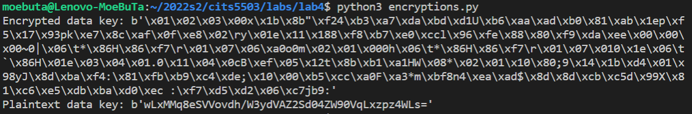

The output for encrypting and decrypting `kms.txt` file:
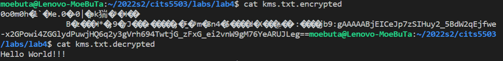

Server-side encryption settings of `kms.txt.encrypted` in AWS console 

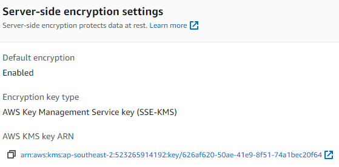

### [Step 3] AES Encryption using local python library pycryptodome

1. we modify the file name into `kms.txt`, and upload the encrypted file `kms.txt.enc` into the bucket. The python code is shown below:
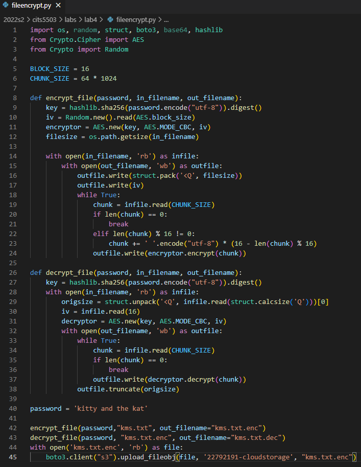

2. Using cat `kms.txt.enc` to look at the encrypted file.
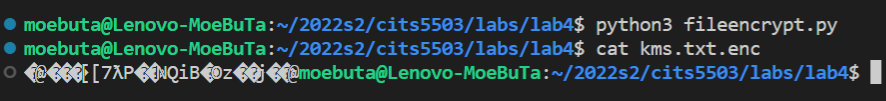

3. Server-side encryption settings of `kms.txt.enc` in AWS console:
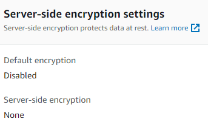

1. Decrypt your encrypted file, present the content. Using cat `kms.txt.dec`. 
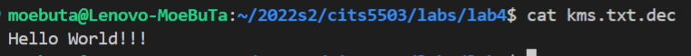

Q: What is the performance difference between using KMS and using the custom solution?

A: 
In terms of the performance of encryption, both of them can encrypt the message inside the file and make it unreadable. However, the custom solution takes longer to be executed compare to using KMS to encrypt and decrypt files, which means using KMS has a better performance. It may be because the custom solution uses sha256 function in the hashlib of Python as the encryption method to encrypt and decrypt file which may need a certain amount of computation resources to be executed. 

The shell script for time calculation and output are shown below:

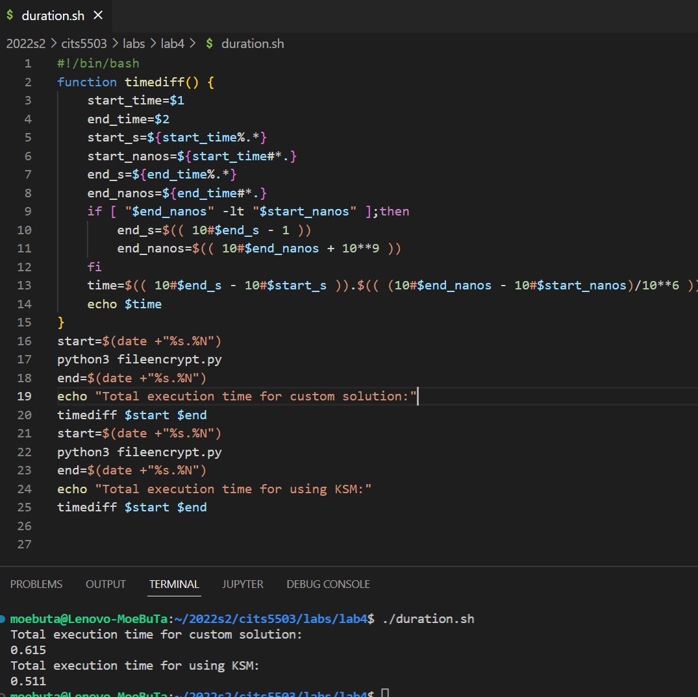