# CITS5503 Lab7
## Wenxiao Zhang 22792191

## **[Step 1] Create an EC2 instance**

we use AWS console to create an EC2 instance:

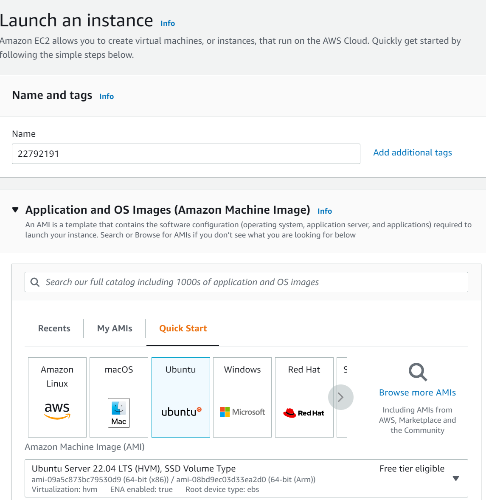

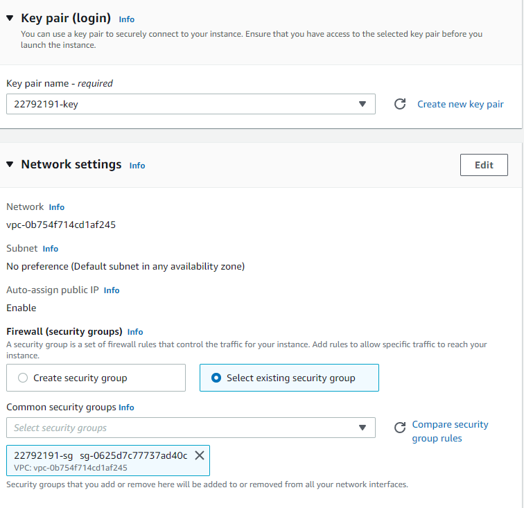

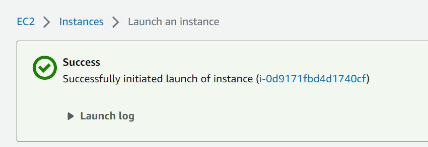

## **[Step 2] Install and configure Fabric on your VM**

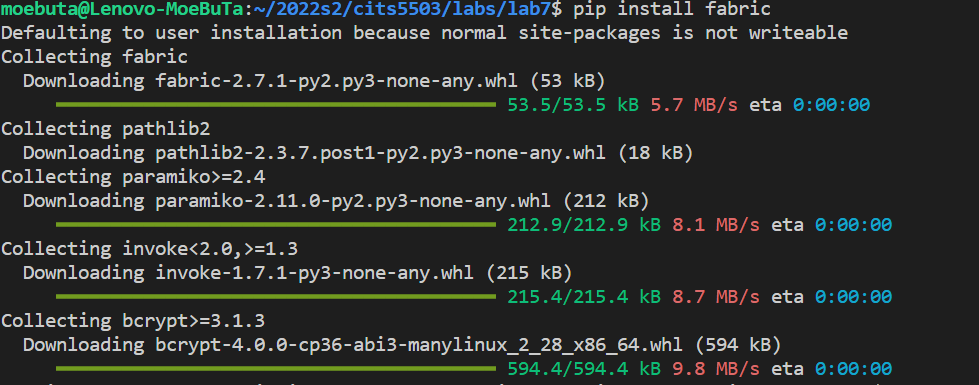

Create a file named `config` in ~/.ssh and add the following contents to it:

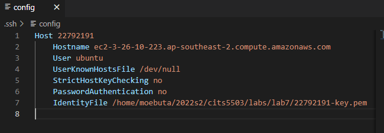

Test fabric from the command line:

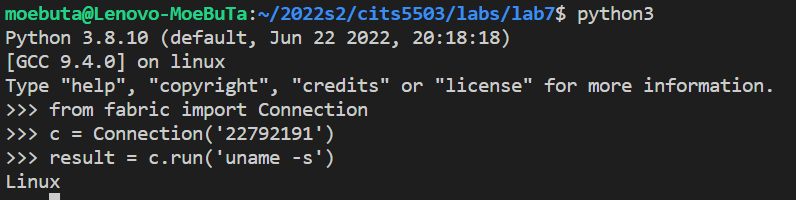

## **[Step 3] Write a python script to automate the installation of nginx**

Write a script `config_nginx.py` for automate installation of nginx.

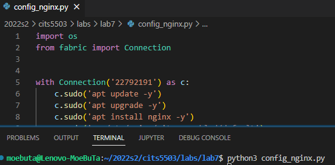

## **[Step 4] Update the python script to install your Django app**

Create a file named `default` and edit the content to prepare for uploading to the ec2 instance.

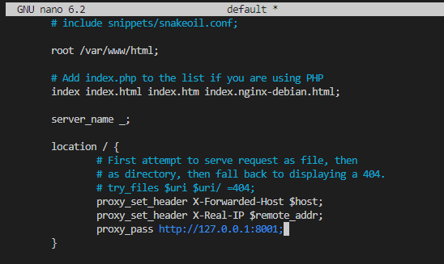

Extend `config_nginx.py` script for replace the default file with local file.

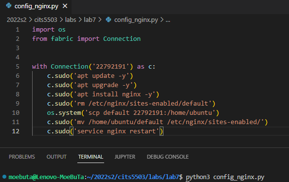

Write another script to config and run Django.

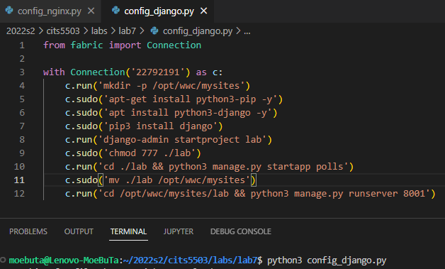

We can see the django server is deployed successfully by accessing the ip address of the instance.

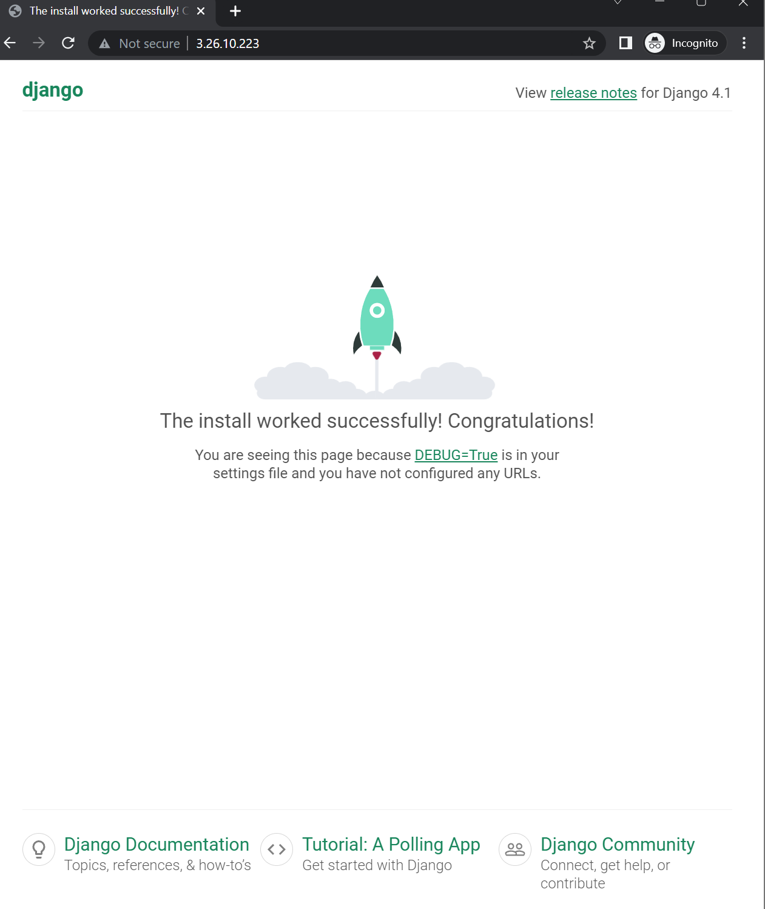

Now we need to write code to update the code in the django. We will edit `polls/views.py`, `polls/urls.py`, and `lab/urls.py`

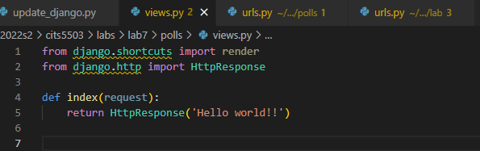

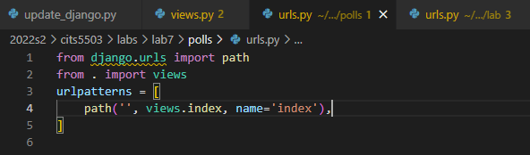

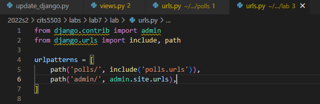

Then we write a script to update the code to the instance:

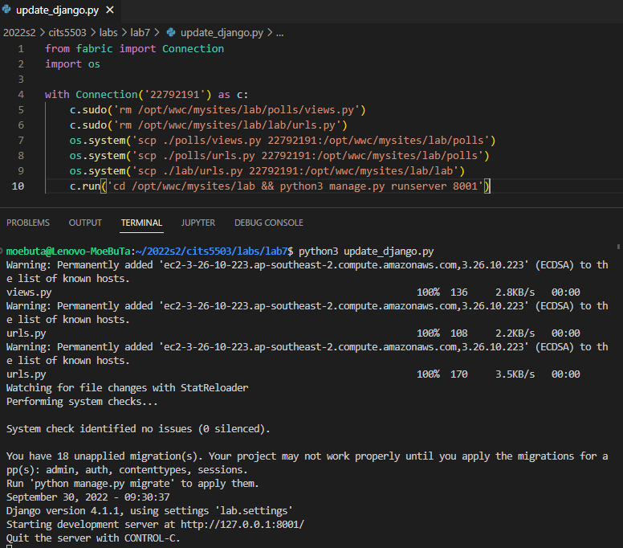

We can see the 'Hello world!!' is displayed in the webpage by accessing the ip address of the instance.

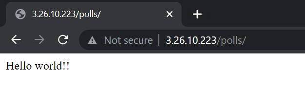

## **[Step 5] Terminate the instance**

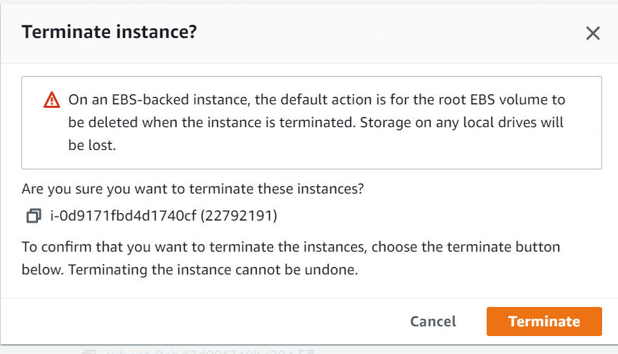

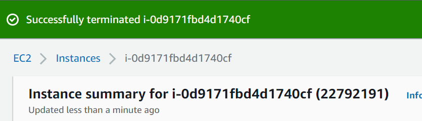