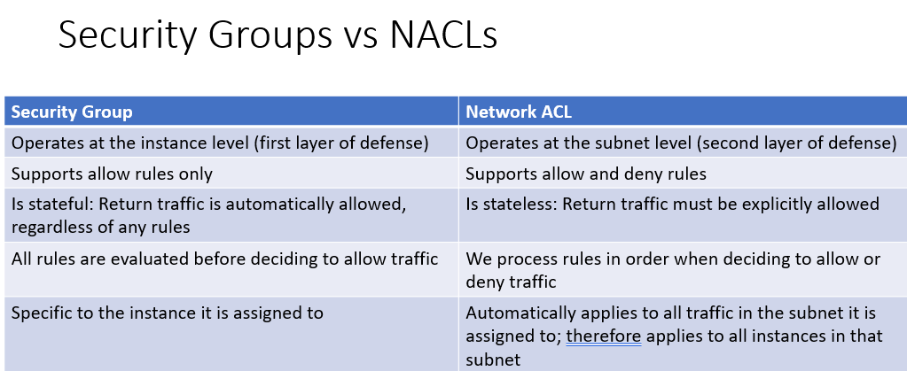

## **Week 7**
**[17] [10 points] Discuss the reasons why you would use Application Load Balancing and how this would be set up to load balance a Python Django application. Specifically, describe the configuration of the Listener and Target Group running the Python Django application.**

Load Balancing pros:

1. big data provided by worldwide users helps businesses make decisions
2. improve efficiency by control the load on a server and maintain operations and responses.
3. predictive analysis for traffic bottlenecks
4. resilience for defective system components with minimised downtime.
5. improve security by adding an extra layer of security without requiring any changes.
6. scalability for changing the server infrastrcuture at any time without impacting services.

The steps to set up load balancer to Django application:
1. set up the Django application to instances.
2. configure a load balancer by specifying name, IP address type, avilable zones.
3. configure security security groups.
4. configure routing by configuring the target group: name protocol, port, target type, and the path for health check.
5. register targets with the configured target group.

**[18] [10 Points] Describe 2 ways in which security is implemented in AWS networks at the network level. What are the similarities and differences between these 2 security implementations?**

https://www.knowledgehut.com/tutorials/aws/nacl-vs-security-groups#:~:text=Security%20groups%20are%20associated%20with,firewall%20to%20protect%20EC2%20instances.

security group:
1. support rules only.
2. stateful.
3. associate with an instance of a service.
4. all rules are applied to an instance.

Network ACLs:
1. support and deny rules.
2. stateless.
3. multiple subnets can be bound with a single NACL.
4. rules are applied in the order of their priority.

## **Week 8**
**[19] [10 points] When an EC2 instance is created in AWS, it is assigned to a region and a Virtual Private Cloud (VPC). Describe how network addresses are allocated to a VPC and sub-networked when an EC2 instance is created. How is the EC2 connected to other machines and to the Internet?**

https://aws.amazon.com/blogs/compute/new-using-amazon-ec2-instance-connect-for-ssh-access-to-your-ec2-instances/

how network addresses are allocated to a VPC:

an address space (IPv4 and IPv6) with size /16 is allocated to a VPC: 172.31.0.0/16 (65536 addresses)

how sub-networked when an EC2 instance is created:

a size /20 default subnet is networked in each availability zone (4096 addresses). 

In this case:
 - a primary private IP address from the IPV4 address range of the subnet is assigned to the default network interface of the instance.
 - a private DNS hostname that resolves to the private subnet range is given to the instance.
 - a public IP address will be allocated to the instance.

Default VPC defines:

 - An address space (IPv4 and IPv6): 172.31.0.0/16 (65,536 addresses)
 - Subnet in each availability zone: e.g. 172.31.0.0/20 and 172.31.16.0/20
 - Internet Gateway 
 - Main Route Table
 - Default Security Group
 - Default Network Access Control List (NACL)
 - Default DHCP settings

To connect to other machines and to the internet:

access the main route table to know the reachable addresses of other machines in the VPC.
 - if address is in local VPC, it can connect directly or through the router if the machine is in a different subnet.
 - if address is not in local VPC, it can connect through the internet gateway according to NACLs.

ssh client:
1. generating the private and public keys for applying SSH client. 
2. using AWS CLI command to authorize the user and push the public key to the instance.
3. connect to the instance using the associated private key after authentication.

**[20] [10 points] What is DevOps and describe how you would implement the automation of creation of machines, configuration of software and deployment of application programs using AWS.**

What is DevOps:

1. Creating automation for the entire build/test/release cycle, 
2. allows Development, Test and Production environments to be built, tested and deployed easily and systematically,
3. Allows new components to be added automatically,
4. Could be done manually with the help of scripts but there are software environments that manage remote communication and execution of resource creation, software installation and configuration.

How to implement:

1. Using fabric to connect to an SSH server and executing commands remotely. 
2. Using the version control tool AWS CodeCommit to maintain changes in the source code.
3. Using AWS CodePipeline to perform Continuous Integration/Continuous Delivery (CI & CD) service for updating code.
4. Using AWS CodeBuild to compile source code, run tests, and produce software packages. 
5. Using AWS CodeDeploy to test and deploy new code.
6. Using AWS Chef to manage machines. stacks, layers and applications can be established. 
 - A layer with a recipe specifies one category of software. Edit our own chef recipe. In the instance interface, we can manage EC2 instances for the particular layer. EC2 will install and configure software according to chef recipe after it starts.

## **Week 9**
**[21] [10 points] Describe the 3 different types of Machine Learning Models that AWS Machine Learning allows you to use and describe examples of the types of questions you could answer with each one.**

https://docs.aws.amazon.com/machine-learning/latest/dg/types-of-ml-models.html

**Binary Classification Model**

"Is this email spam or not spam?"

"Will the customer buy this product?"

"Is this product a book or a farm animal?"

"Is this review written by a customer or a robot?"

**Multiclass Classification Model**

"Is this product a book, movie, or clothing?"

"Is this movie a romantic comedy, documentary, or thriller?"

"Which category of products is most interesting to this customer?"

**Regression Model**

"What will the temperature be in Seattle tomorrow?"

"For this product, how many units will sell?"

"What price will this house sell for?"

**[22] [10 points] Describe the different ways in which a Microservice Architecture can be implemented on AWS and what the benefits of this approach might be. How could authentication and authorisation be handled in this approach?**

Microservices can be hosted on Lambda (Serverless), Containers, or can be other Django/Ruby/NodeJS apps.

Front end is via an API Gateway that defines a programmatic interface to the services

Benefits of Rest API based API Gateway are:
 - Language agnostic
 - Maintains an interface that encapsulates implementation
 - Can use SQS to allow queues to invoke APIs
Need to handle authentication and authorisation for the API
- Use IAM either directly or through API Gateway Resource Policies
- Use Cognito
- Use API keys
- Use an external service through Lambda

## **Week 10**
**[23] [20 points]** 

**[a] [15 points] You have been asked to create a project plan for the new machine learning model your company has asked you to build. List the main tasks and sub-tasks you would need to complete to create the model on AWS.** 

1. collecting labeled data and setup a target variable and a list of feature variables.
2. preprocess the data by performing data cleaning, feature scaling, data transformation
3. analysing the correlations between variables.
4. splitting data into training (70%) validation (10%) testing (20%) sets.
5. selecting a machine learning model.
6. tuning hyperparameters.

**[b] [5 points] How would you measure the accuracy of the model you created?**

Using evaluation metrics to assess the accuracy of each model, specifically:
-	Binary classification – Accuracy, Precision, AUC
-	Multiclass classification – Precision, Recall, F1, AUC
-	Regression – RMSE, Accuracy
