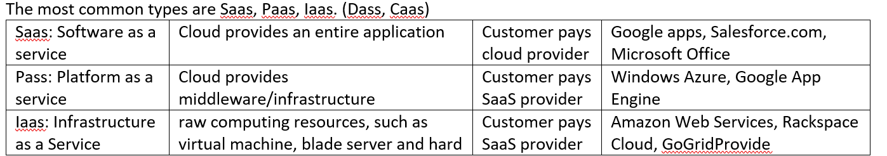

## **Cloud computing characteristics**

pros:
1. Reducing IT costs for hiring IT experts and maintaining local host machines.
2. No up-front investment, pay-as-you-go model
3. Scalability: quickly scale up/down as damand varies.
4. Security: a collection of security measures designed to protect cloud services.

cons:
1. downtime issues due to possible outages of cloud-based services.
2. privacy issues due to store important data on external service providers.
3. cybersecurity issues due to the exposure of vulnerabilities in system components.
4. cost issues for small scale and short-term projects.

Problems of running ones own data centers:
 - difficult to scale up or down
 - difficult to manage resources
 - difficult to perform maintenance

XaaS cloud computing:

## **DevOps, Security, Networking**

**[20] [10 points] What is DevOps and describe how you would implement the automation of creation of machines, configuration of software and deployment of application programs using AWS.**

What is DevOps:

1. Creating automation for the entire build/test/release cycle.
2. Allows Development, Test and Production environments to be built, tested and deployed easily and systematically,
3. Allows new components to be added automatically,

4. It Could be done manually with the help of scripts but there are software environments that manage remote communication and execution of resource creation, software installation and configuration.

How to implement:

1. Using fabric to connect to an SSH server and executing commands remotely. 
2. Using the version control tool AWS CodeCommit to maintain changes in the source code.
3. Using AWS CodePipeline to perform Continuous Integration/Continuous Delivery (CI & CD) service for updating code.
4. Using AWS CodeBuild to compile source code, run tests, and produce software packages. 
5. Using AWS CodeDeploy to test and deploy new code.
6. Using AWS Chef to manage machines. stacks, layers and applications can be established. 
 - A layer with a recipe specifies one category of software. Edit our own chef recipe. In the instance interface, we can manage EC2 instances for the particular layer. EC2 will install and configure software according to chef recipe after it starts.

**[18] [10 Points] Describe 2 ways in which security is implemented in AWS networks at the network level. What are the similarities and differences between these 2 security implementations?**

https://www.knowledgehut.com/tutorials/aws/nacl-vs-security-groups#:~:text=Security%20groups%20are%20associated%20with,firewall%20to%20protect%20EC2%20instances.

security group: it controls the traffic that is allowed to reach and leave the resources at the instance level.
1. support rules only.
2. stateful.
3. associate with an instance of a service.
4. all rules are applied to an instance.

Network ACLs: it allows or denies specific traffic to reach and leave the resources at subnet level.
1. support and deny rules.
2. stateless.
3. multiple subnets can be bound with a single NACL.
4. rules are applied in the order of their priority.

**[19] [10 points] When an EC2 instance is created in AWS, it is assigned to a region and a Virtual Private Cloud (VPC). Describe how network addresses are allocated to a VPC and sub-networked when an EC2 instance is created. How is the EC2 connected to other machines and to the Internet?**

https://aws.amazon.com/blogs/compute/new-using-amazon-ec2-instance-connect-for-ssh-access-to-your-ec2-instances/

`The number after the slash indicates how many ones are in the subnet mask`

`IP addr = network addr + host addr`

`The network address is used to find the subnet in which the computer or the device is located`

`The host address is used to find the computer or the device in the subnet`

how network addresses are allocated to a VPC:

an address space (IPv4 and IPv6) with size /16 is allocated to a VPC: 172.31.0.0/16 (65536 addresses)

how sub-networked when an EC2 instance is created:

a size /20 default subnet is networked in each availability zone (4096 addresses). 

In this case:
 - a primary private IP address in the network address range is assigned to the default network interface (eth0) of the EC2 instance.
 - a private DNS hostname that resolves to the private subnet range is given to the EC2 instance.
 - a public IP address will be allocated to the EC2 instance.

Default VPC defines:

 - An address space (IPv4 and IPv6): 172.31.0.0/16 (65,536 addresses)
 - Subnet in each availability zone: e.g. 172.31.0.0/20 and 172.31.16.0/20
 - Internet Gateway 
 - Main Route Table
 - Default Security Group
 - Default Network Access Control List (NACL)
 - Default DHCP settings

To connect to other machines and to the internet:

access the main route table to know the reachable addresses of other machines in the VPC.
 - if address is in local VPC, it can connect directly or through the router if the machine is in a different subnet.
 - if address is not in local VPC, it can connect through the internet gateway according to NACLs.

ssh client:
1. generating the private and public keys for applying SSH client. 
2. using AWS CLI command to authorize the user and push the public key to the instance.
3. connect to the instance using the associated private key after authentication.

## **Load balancing**

**[17] [10 points] Discuss the reasons why you would use Application Load Balancing and how this would be set up to load balance a Python Django application. Specifically, describe the configuration of the Listener and Target Group running the Python Django application.**

`LB: Load Balancing distributes incoming application traffic across multiple targets (EC2 instances).`

`ELB: Elastic Load Balancing scales load balancer dynamically over time based on the incoming traffic conditions.`

`ALB: Application Load Balancer is usually applied to web applications using HTTP/HTTPS protocols.`

`NLB: Network LB, GWLB: Gate Way LB`

Load Balancing distributes incoming application traffic across multiple targets (EC2 instances).

**Load Balancing advantages:**

1. It allows horizontal scale by dynamically changing the number of instances based on the demand.
2. It allows for update of code on instances without interrupting service.
3. It can handle termination of SSL/TLS so that there will be less load and simpler code on instances.
4. It improves security by adding an extra layer of security so that instances are not directly accessible from the Internet.

5. It can perform predictive analysis for traffic bottlenecks
6. It has resilience for defective system components with minimised downtime.
7. scalability for changing the server infrastrcuture at any time without impacting services.

**The steps to set up load balancer to Django application:**
1. create security group.
2. set up the Django application to instances.
3. create a load balancer by specifying name, IP address type, avilable zones.
4. create target group.
5. configuring the target group and the Listener: name, protocol (HTTP), port (80), action (forward to the created target group), and the path for health check.
6. register targets with the configured target group.
7. deploy the services and check the healthy status of each target.

## **AWS machine learning**

- Underfitting: model is too “simple” to represent all the relevant class characteristics
  - High bias and low variance
  - High training error and high test error
- Overfitting: model is too “complex” and fits irrelevant characteristics (noise) in the data
  - Low bias and high variance
  - Low training error and high test error

**[21] [10 points] Describe the 3 different types of Machine Learning Models that AWS Machine Learning allows you to use and describe examples of the types of questions you could answer with each one.**

https://docs.aws.amazon.com/machine-learning/latest/dg/types-of-ml-models.html

**Binary Classification Model**

"Is this email spam or not spam?"

"Will the customer buy this product?"

"Is this product a book or a farm animal?"

"Is this review written by a customer or a robot?"

**Multiclass Classification Model**

"Is this product a book, movie, or clothing?"

"Is this movie a romantic comedy, documentary, or thriller?"

"Which category of products is most interesting to this customer?"

**Regression Model**

"What will the temperature be in Seattle tomorrow?"

"For this product, how many units will sell?"

"What price will this house sell for?"

**[a] [15 points] You have been asked to create a project plan for the new machine learning model your company has asked you to build. List the main tasks and sub-tasks you would need to complete to create the model on AWS.** 

1. collecting labeled data and setup a target variable and a list of feature variables.
2. preprocess the data by performing data cleaning, feature scaling, data transformation.
3. analysing the correlations between variables.
4. splitting data into training (80%) and testing (20%) sets.
5. selecting a machine learning model.
6. training the model using training set and tuning hyperparameters.
7. evaluate the trained model (run on test data, or use metric to validate, validation metrics including MAE, RMSE and MSE since this have to be regression model )

## **Storage, Database in AWS**

**Describe EBS and what features it offers.**

Amazon EBS (Amazon Elastic Block Store) provides block level storage volumes for use with EC2 instances. 

1. It can replicate data through multiple servers so the data won't be lost if a single server is down.
2. It can encrypt data automatically in EBS data volumes, boot volumes, and snapshots.
3. It can create a snapshot of the EBS volume which can be recreated at any time.
4. It can increase size automatically with little downtime.
5. It can provide lower latency, higher IOPS, and higher throughput service using SSD or HDD based on the demand.
6. It can be placed in specific availability zones.

## **Web architecture and framework**

**[22] [10 points] Describe the different ways in which a Microservice Architecture can be implemented on AWS and what the benefits of this approach might be. How could authentication and authorisation be handled in this approach?**

Microservices can be hosted on Lambda (Serverless), Containers, or can be other Django/Ruby/NodeJS apps.

Front end is via an API Gateway that defines a programmatic interface to the services

Benefits of Rest API based API Gateway are:
 - Language agnostic
 - Maintains an interface that encapsulates implementation
 - Can use SQS to allow queues to invoke APIs
Need to handle authentication and authorisation for the API
- Use IAM either directly or through API Gateway Resource Policies
- Use Cognito
- Use API keys
- Use an external service through Lambda

## **Docker and container**

A container is a standard unit of software that packages up the application and all its dependencies and libraries by virtualising the operating system.

Docker offers the ability to run multiple applications within the same host OS, sharing underlying resources.

Docker vs Container:
1. Similarity: Both containers and docker images allow users to specify application dependencies and configurations and to describe everything necessary for a machine to run the application.
2. Differences: All Containers use the same underlying OS but present various parts of the OS as if they were dedicated to the running system, whereas Docker is an application that provides a secure and isolated environment to run containers.

Docker vs VMBox:
1. Similarity: Both Docker and VirtualBox are virtualisation tools running on the computer.
2. Differences: VirtualBox is an virtualization app that create virtual machines that are isolated at the hardware level, whereas Docker is a containerization app that isolates apps at application level. 

## **S3 bucket**

**Describe what S3 is and discuss its similarities and differences with the data store DynamoDB.**

Simple Storage Service (S3) is an AWS cloud service used for object storage. S3 buckets are provided to users to store file objects. Permission and authentication settings are available for users to determine who is allowed or not allowed to perform specific actions with the resources in the bucket.

Similarities: 
1. they are both storage-based services,
2. high performance, scalability, availability, security. 
Differences:
1. S3 stores all objects with data and metadata in the bucket, whereas DynamoDB is a NoSQL database storing key-value pairs.
2. S3 mainly stores media files such as images, videos, sound files etc., while DynamoDB mainly stores document-based files. 
3. S3 has the version control mechanism while DynamoDB doesn't.
