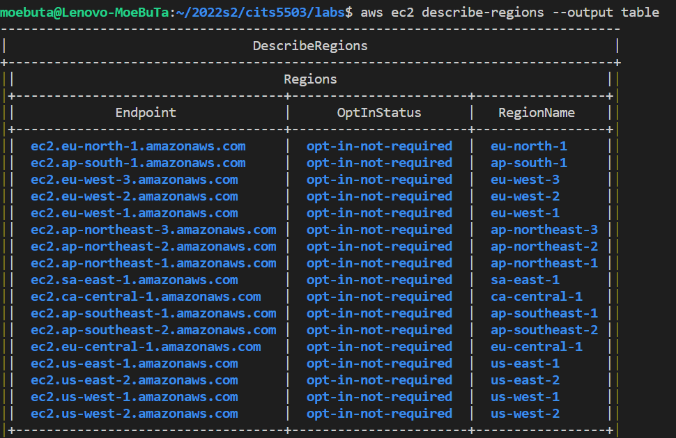
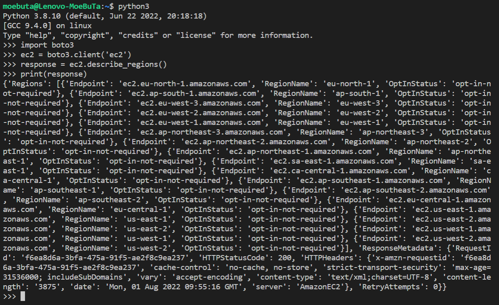
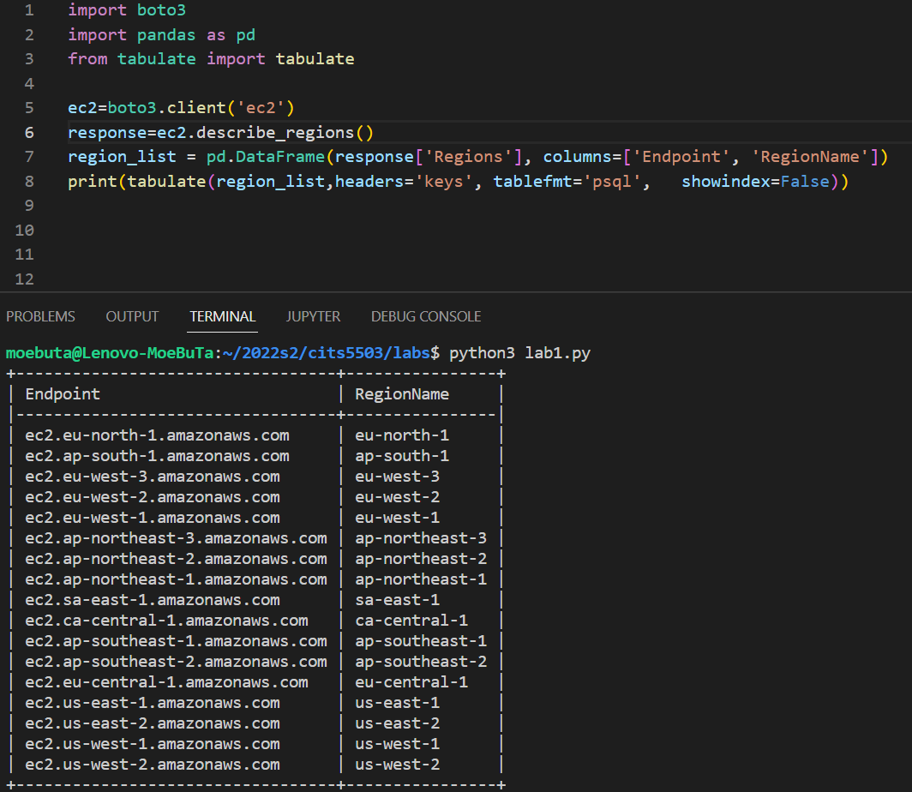

# CITS5503 Lab1 
## Wenxiao Zhang 22792191

<br>

## 1. Test the aws environment by running:

```aws ec2 descibe-regions --output table```

The test result is shown below:


<div style="page-break-after: always;"></div>

## 2. Test the python environment
the test processes and results are shown below:


<div style="page-break-after: always;"></div>

## 3. Put this code into a python file and tabulate the print to have 2 columns with Endpoint and RegionName
we use `pandas` and `tabulate` to do this task, the python code and result are shown below:
