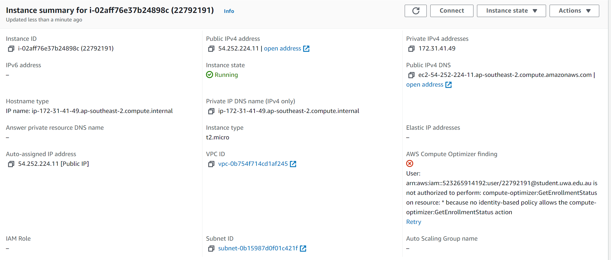

# CITS5503 Lab2 
## Wenxiao Zhang 22792191

 

## Create an EC2 instance using awscli

### [1] Create a security group

### [2] Authorise inbound traffic for ssh

### [3] Create a key pair that will allow you to ssh to the EC2 instance
we make a directory named `.ssh`, then copy the key pair to the directory.

### [4] Create the instance and note the instance id

add a tag to the instance:

### [5] Get the public IP address

### [6] Connect to the instance

### [7] Look at the instance using the AWS console

### [8] Terminate the instance

## Create an EC2 instance with Python Boto script

### Repeat the steps above using the equivalent Boto commands in a python script. The script should output the IP address to connect to.
### Step 1 – Create a security group
python code:

output:

### Step 2 - Authorise inbound traffic for ssh, from port/to port 22 indicates ssh, and CidrIp 0.0.0.0/0 indicates directions
python code:

output:

### Step 3 – Create the key pair via create_key_pair function to allow ssh into EC2 instance
python code:

output:

### Step 4 – Create the instance via run_instance function and return the instance id
python code:

output:

AWS console:

Step 5 – Return the public IP of the instance created from previous steps via describe_instance function
python code:

output:

## Using Docker

### [1] Install Docker

### [2] Check the version

### [3] Build and run an httpd container
we make a directory named `html`, then create `index.html` using `touch` command, then edit `index.html` using `nano` command, then we print the content of `index.html` using `cat` command.

### [4] Create a file called “Dockerfile” outside the html directory with the following content:
We use `touch` command to create `Dockerfile`, then use `nano` to edit it, then we print the content of `Dockerfile` using `cat` command.

### [5] Build the docker image

### [6] Run the image

### [7] Open a browser and access address http://localhost Confirm you get Hello World!

### [8] Other commands

