# CITS5503 Lab3 
## Wenxiao Zhang 22792191

 

### [Step 1] Preparation

Download the python code cloudstorage.py from https://github.com/dglance/cits5503/blob/master/Labs/src/cloudstorage.py

Create a directory rootdir

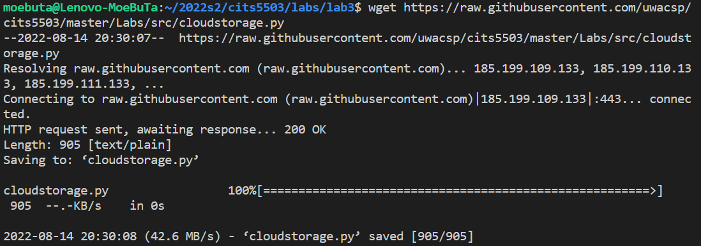

Create a file in rootdir called rootfile.txt and put some content in it “1\n2\n3\n4\n5\n”

Create a second directory in rootdir called subdir and create another file subfile.txt with the same content as rootfile.txt

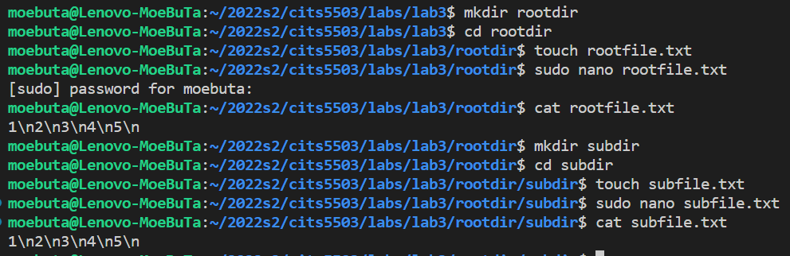

### [Step 2] Save to S3

Edit cloudstorage.py to take one argument: -i, --initialise=True – this will use boto to create a bucket on S3 that is identified by 22792191-cloudstorage

Insert boto commands to save each file that is found as the program traverses the directory starting at the root directory rootdir.

python code:
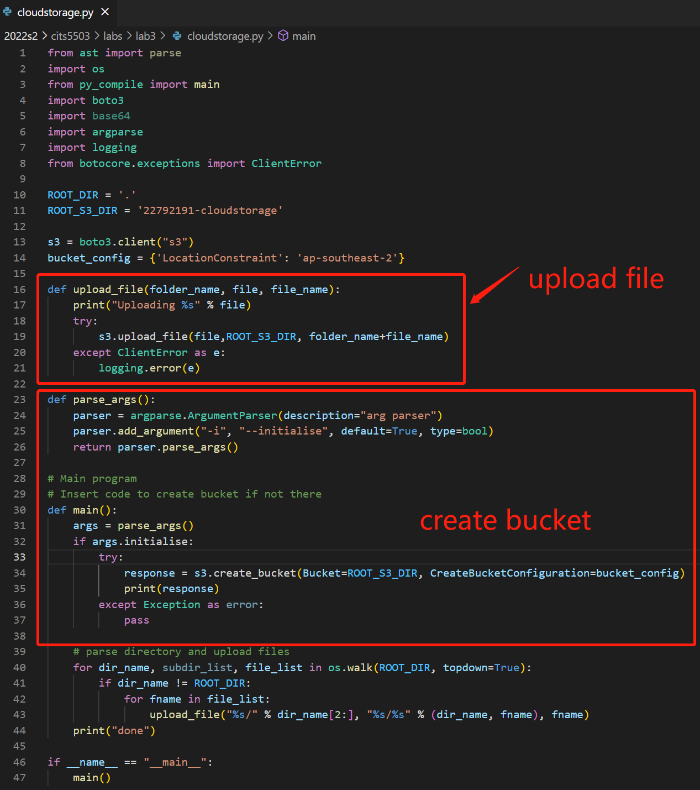

output for creating a bucket with student number:
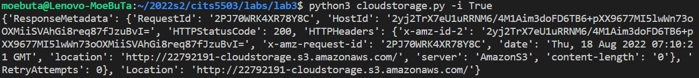

output for save each file:
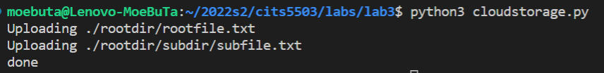

Open AWS console to confirm:
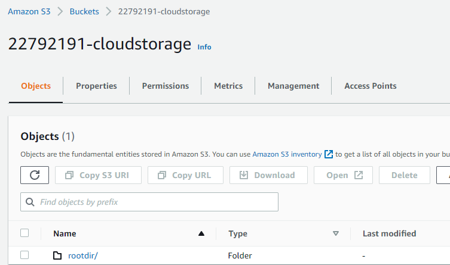
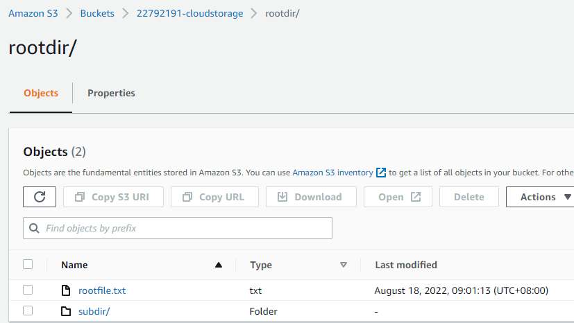
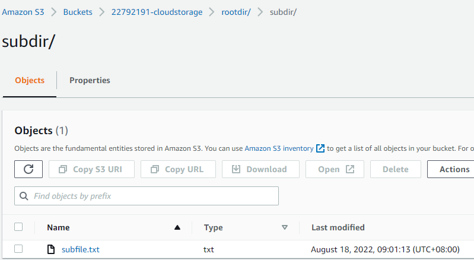

### [Step 3] Restore from S3

Create a new program called restorefromcloud.py that reads the S3 bucket and writes the contents of the bucket within the appropriate directories. You should have a copy of the files and the directories you started with.

python code:

output:
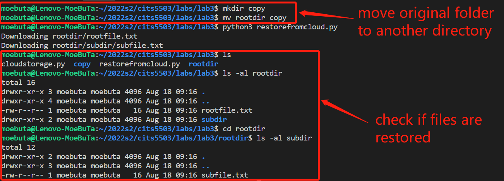
### [Step 4] Write information about files to DynamoDB

Install DynamoDB on your VM.

mkdir dynamodb;

cd dynamodb

Install jre if not done

sudo apt-get install default-jre

wget https://s3-ap-northeast-1.amazonaws.com/dynamodb-local-tokyo/dynamodb_local_latest.tar.gz

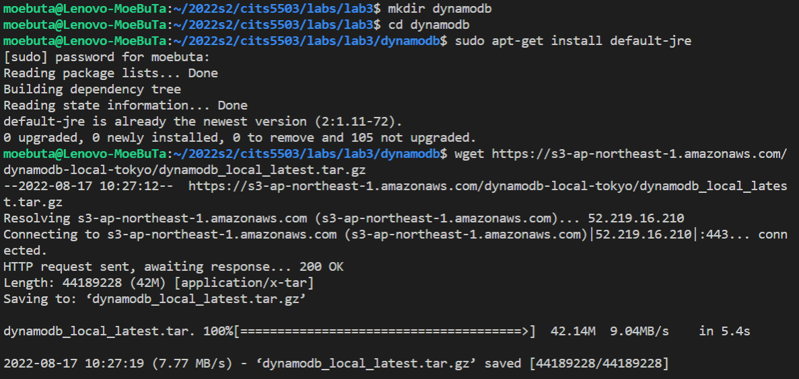

java -Djava.library.path=./DynamoDBLocal_lib -jar DynamoDBLocal.jar –sharedDb

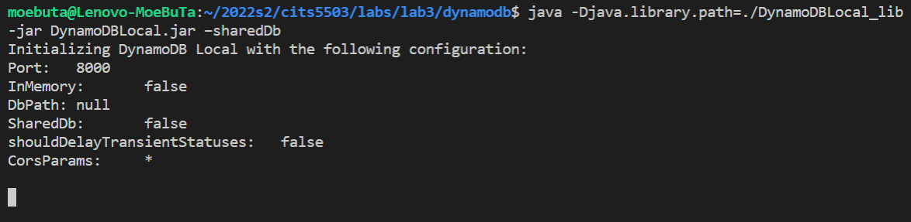

Create a table on your local DynamoDB with the key userId The attributes for the table will be:

        CloudFiles = {
            'userId',
            'fileName',
            'path',
            'lastUpdated',
	    'owner',
            'permissions'
            }
        )

For every file that is stored in S3, get the information to put in the DynamoDB item and write it to the table. You will have to find functions in Python to get details like time lastUpdated, owner and permissions. All of this information can be stored as strings.

Creating table:
We set `CloudFiles` to be the table name, `userId` to be the partition key, and `fileName` to be the sort key. 

Python code to extract user information from bucket and put them into the local dynamoDB:
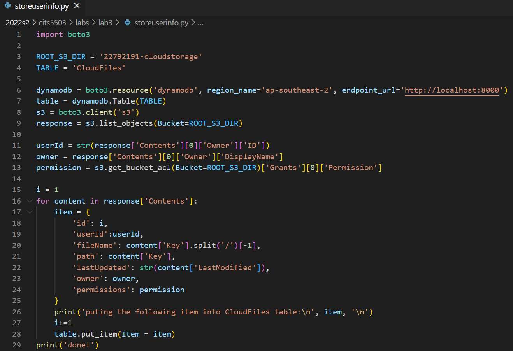

Output:
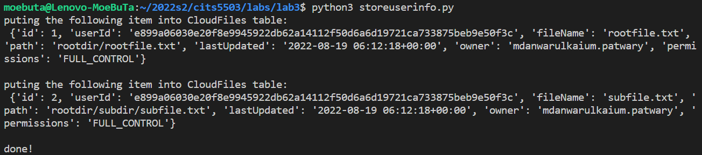

Scan the content of the local table:
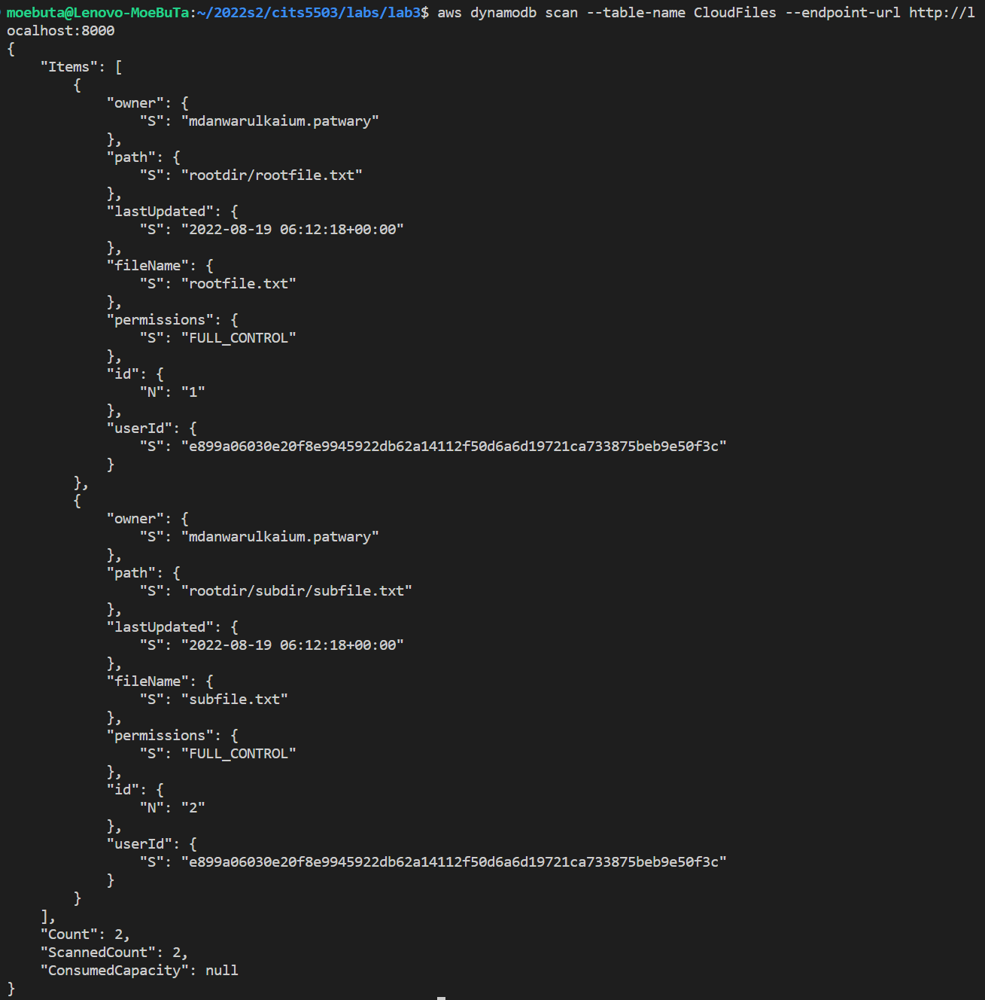