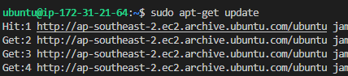
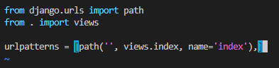
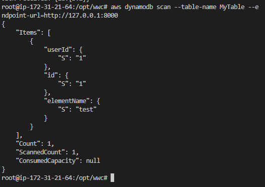

# CITS5503 Lab6
## Wenxiao Zhang 22792191

## **Step 1: Create an EC2 instance**

**1.1 Create an EC2 micro instance using Ubuntu and SSH into it.**

using AWS console to launch an instance

using Ubuntu and SSH into it

**1.2 update package and install python venv**
   

**1.3 install python pip**

**1.4 Create a directory with a path /opt/wwc/mysites and cd into that. Set up a virtual environment.**

we can see that the directories are all listed properly:

Activate the virtual environment and install django:

we can see 3 items: lab, manage.py and polls under the lab project,
and items: __init__.py, admin.py, apps.py, migrations, models.py, tests.py and views.py under `polls` directory.

## **Step 2: Install and configure nginx (under polls)**

## **Step 3:  Changing the code**

Edit polls/views.py (just an example)
Under lab type vim polls/views.py

Edit polls/urls.py
Under lab, type vim polls/urls.py

Edit lab/urls.py
Under lab, type vim lab/urls.py

Now run `python3 manage.py runserver 8000`

## **Step 4: Create a load balancer**

use AWS console to create a load balancer named `22792191-lb`

Change the path of the health check of the target group

Register the instance into the target group `22792191-tg`

We can see that the instance is healthy now

Delete load balancer

## **Extension step**

configure aws in the instance

Install DynamoDB and JRE in the instance

Create a table in DynamoDB

Insert an element into the DynamoDB

scan the table to see the element

install boto3

Modify code in `polls/views.py`

Modify nginx proxy port number into 8001 and restart service

Deploy Django in 8001 port

Open the browser and we can see the `elementName` value: "test" is displayed in the browser.

