# CITS5503 Lab8
## Wenxiao Zhang 22792191

## **Set Up Python Environment**

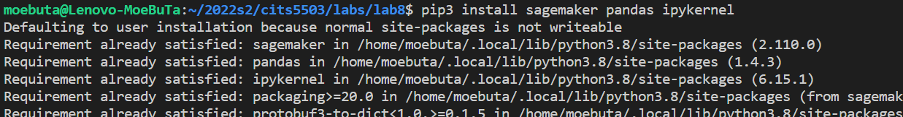

## **Create a bucket**

The properties of the created bucket is shown below:

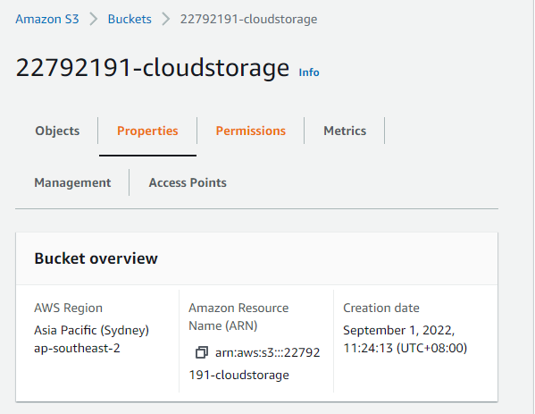

## **Session preparation**

add an student id and bucket name to prepare SageMaker session.

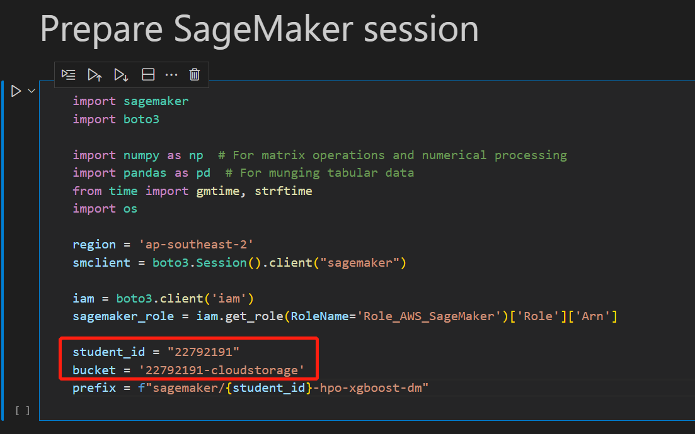

## **Download Dataset**

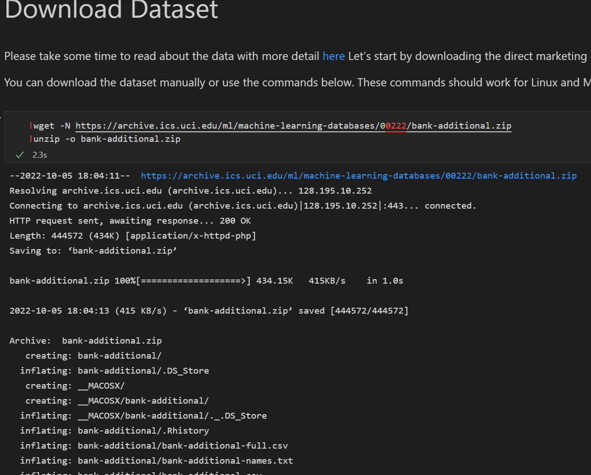

## **Run the rest of the code**

for the variables of the dataset in the screenshort, for example, `age`, `duration` are numerical variables, `marital`, `housing` are categorical variables.

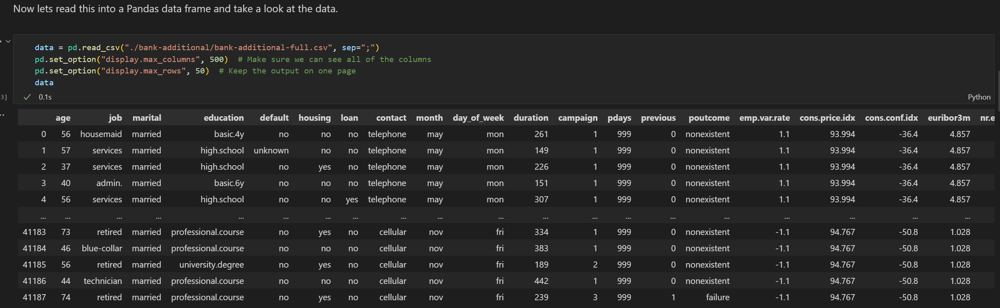

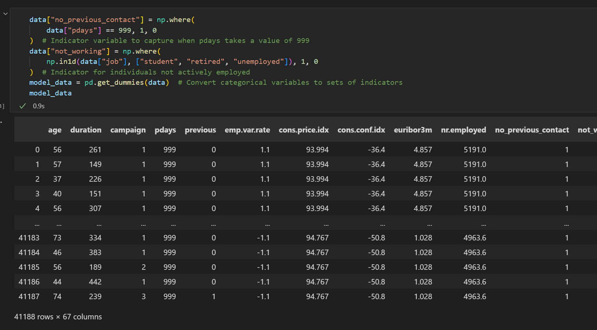

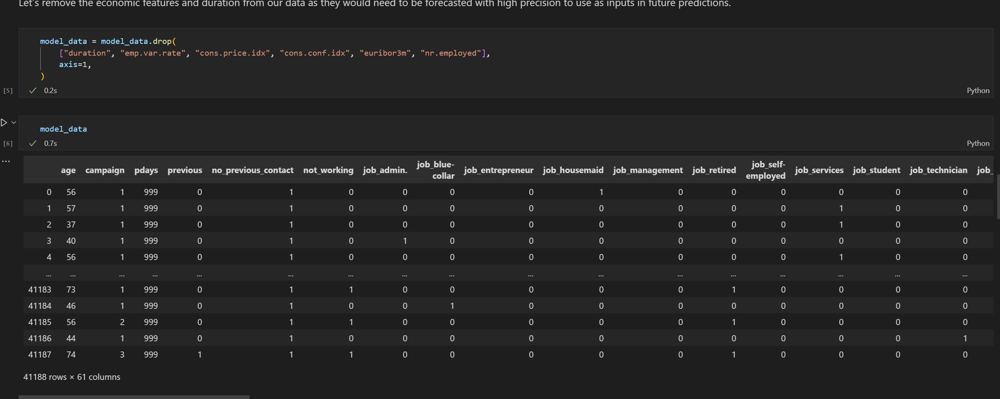

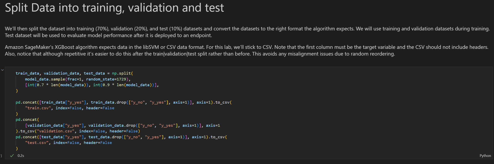

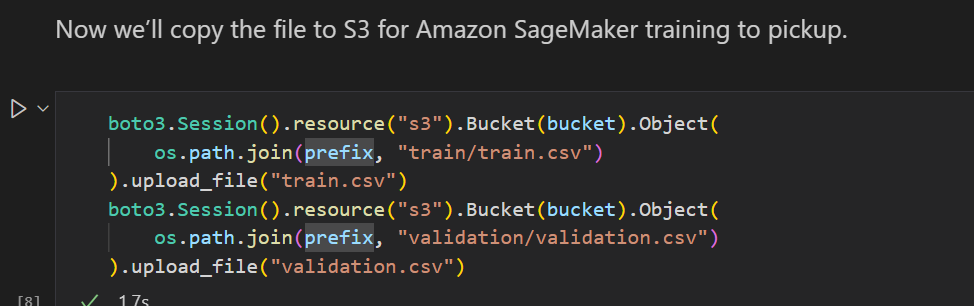

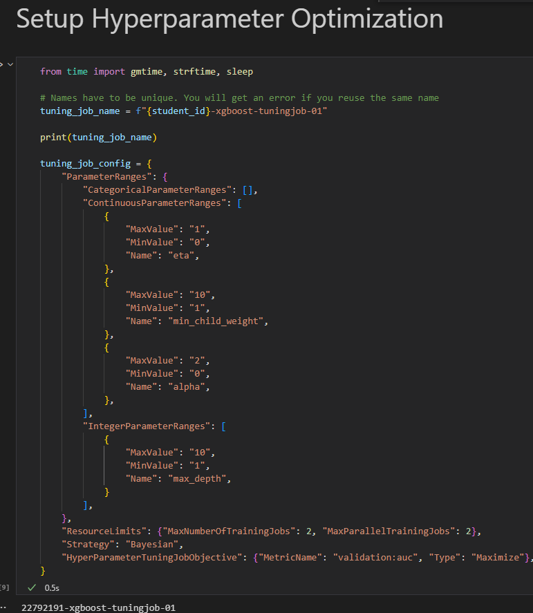

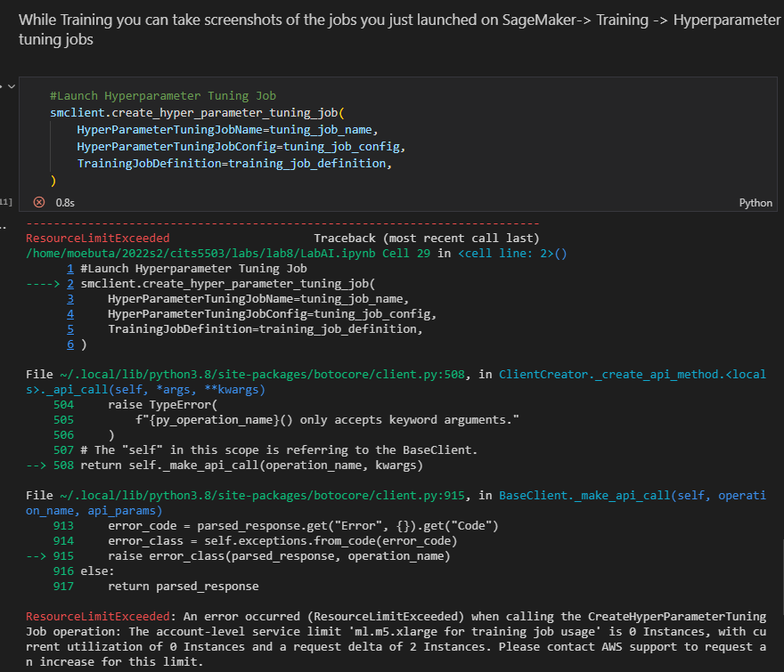

## **Files in the bucket**

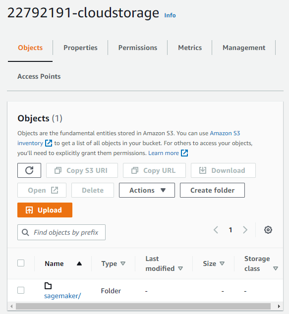

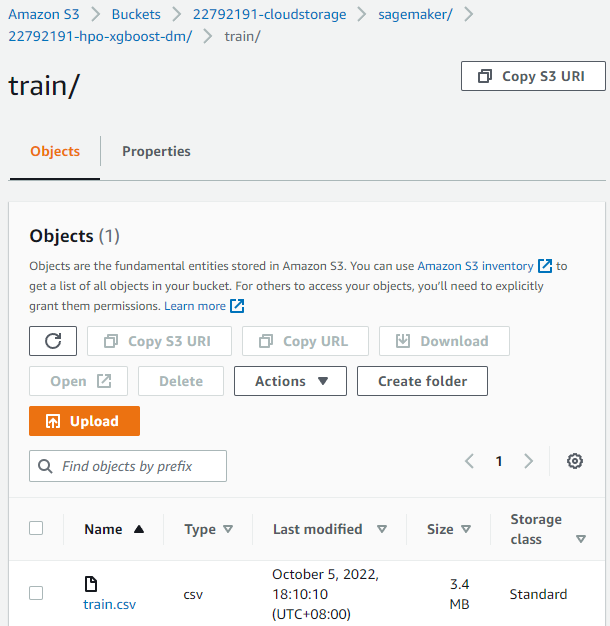

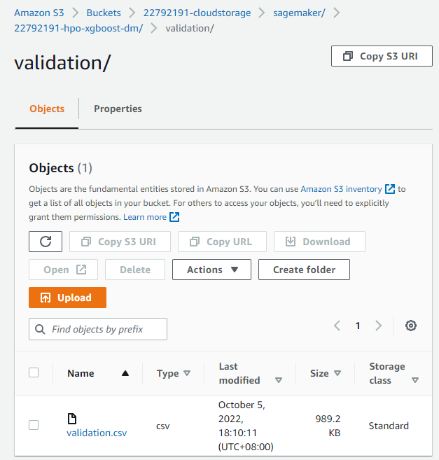

## **Questions**

**a) In your S3 bucket, how many folders were created using the script (under the "{student_id}-hpo-xgboost-dm" folder)? List their name.**

Two folders were created: `train` and `validation`.

**b) How many Hyperparameter tuning jobs were created using the script?**

Two Hyperparameter tuning jobs were created.

**c) What metric was used in this script to evaluate the training results?**

The `validation:auc` was used in this script, and the type is `maximize`.

**d) What strategy was used in the tuning job?**

`Bayesian` was used in the tuning job.